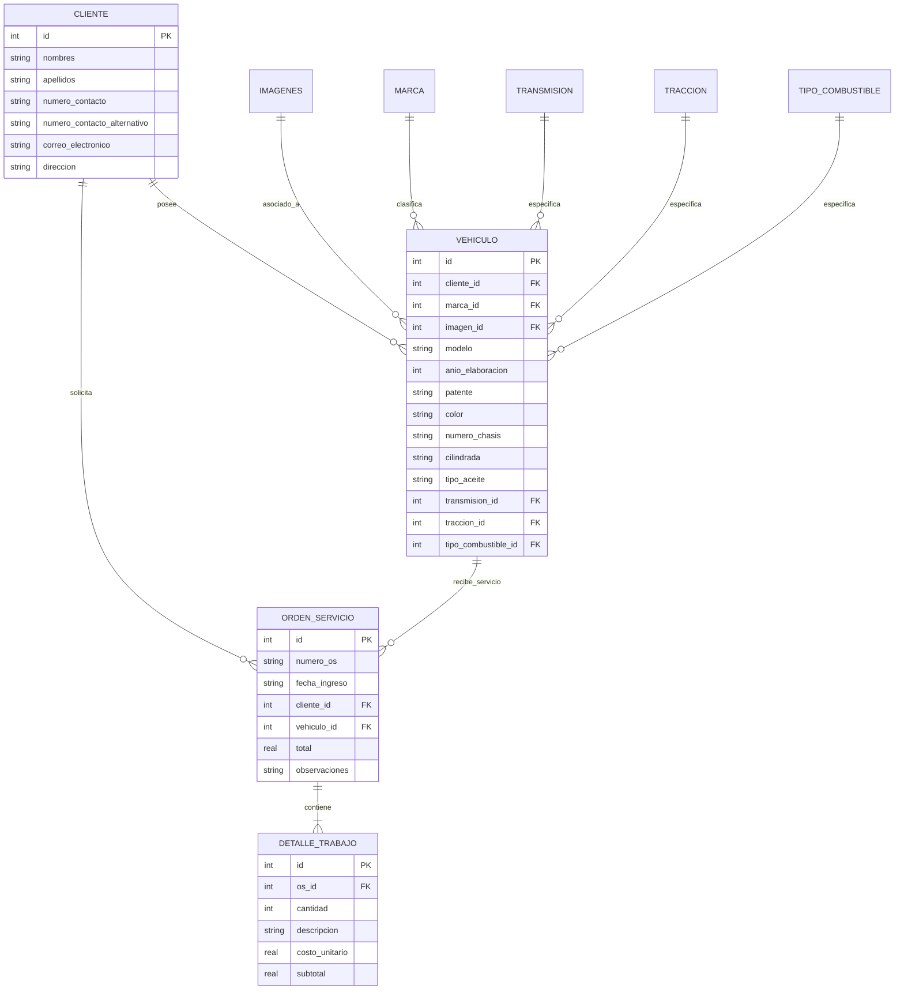

# Auto Solution - Gestión de Taller ("Don Michel")

Este proyecto es una aplicación web empresarial diseñada específicamente para gestionar las operaciones diarias de un taller mecánico automotriz. Permite el control de clientes, el registro detallado de vehículos, la creación de órdenes de servicio, el cálculo automático de presupuestos y la visualización de métricas financieras.

El sistema forma parte del ecosistema **Auto Solution**, funcionando de manera totalmente autónoma con su propio almacén de base de datos local y gestión de usuarios.

---

## Tecnologías y Lenguajes Utilizados

El proyecto está desarrollado bajo una arquitectura monolítica ligera y eficiente, utilizando tecnologías estándar:

* **Backend (Servidor)**: 
  * **Python 3.10+**: Lenguaje de programación principal.
  * **Flask**: Framework web ligero para el enrutamiento, lógica de negocios y manejo de sesiones.
  * **SQLite3**: Motor de base de datos relacional para almacenar tanto la información operacional del taller (`base_datos/taller.db`) como el control local de cuentas de usuario (`base_datos/usuarios.db`).
* **Frontend (Interfaz de Usuario)**:
  * **HTML5**: Estructuración semántica de las vistas y plantillas dinámicas Jinja2.
  * **CSS3 (Vanilla)**: Diseño visual limpio, modularizado por componentes con soporte adaptativo (Responsive Design).
  * **JavaScript (Vanilla - ES6)**: Lógica interactiva del lado del cliente para llamadas AJAX (Fetch API), validación de formularios y manipulación del DOM en tiempo real.
  * **Chart.js**: Biblioteca externa utilizada en el panel de estadísticas para renderizar gráficos de rendimiento financiero.

---

## Requisitos e Instalación

### Requisitos del Sistema
* **Python 3.10** o superior instalado en el sistema.

### Instrucciones de Instalación
1. Navega al directorio del proyecto:
   ```bash
   cd don_michel/aplicacion_maicol
   ```

2. Crea y activa un entorno virtual de Python:
   ```bash
   # En Windows
   python -m venv venv
   venv\Scripts\activate
   
   # En Linux/macOS
   python3 -m venv venv
   source venv/bin/activate
   ```

3. Instala las dependencias del proyecto:
   ```bash
   pip install -r requirements.txt
   ```

4. Genera o verifica las bases de datos locales ejecutando el script de inicialización del taller (o simplemente arranca la aplicación, que creará de forma automática las bases de datos vacías y el usuario administrador por defecto):
   ```bash
   python ../generarbd.py
   ```

5. Inicia el servidor de Flask:
   ```bash
   python app.py
   ```
   *(La aplicación estará disponible en http://localhost:5001 o https://localhost:5001 si se habilitó SSL).*

---

## Descripción de las Páginas del Sistema

La interfaz está dividida en vistas modulares y enfocadas en la experiencia del usuario final:

| Página / Vista | Archivo de Plantilla | Descripción Funcional |
| :--- | :--- | :--- |
| **Inicio de Sesión** | [login.html](file:///C:/Users/corte/Documents/aplicaciones/don_michel/aplicacion_maicol/templates/login.html) | Portal de acceso seguro que valida las credenciales contra la base de datos de usuarios local. Redirige según el rol asignado. |
| **Registro de Órdenes** | [registro.html](file:///C:/Users/corte/Documents/aplicaciones/don_michel/aplicacion_maicol/templates/registro.html) | Formulario dinámico unificado que permite registrar simultáneamente un nuevo cliente, asociar su vehículo y abrir una Orden de Servicio (OS) inicial en un solo paso interactivo. |
| **Historial de Servicios** | [historial.html](file:///C:/Users/corte/Documents/aplicaciones/don_michel/aplicacion_maicol/templates/historial.html) | Panel de consulta que lista todas las órdenes de servicio generadas. Incluye filtros de búsqueda en tiempo real por número de OS, nombre del cliente y patente del vehículo. |
| **Detalle de Orden de Servicio** | [orden_servicio.html](file:///C:/Users/corte/Documents/aplicaciones/don_michel/aplicacion_maicol/templates/orden_servicio.html) | Vista detallada de una orden específica. Permite añadir dinámicamente filas de repuestos o mano de obra, calcula subtotales e importes en tiempo real y ofrece una vista optimizada para impresión (presupuesto/factura). |
| **Control de Clientes** | [clientes.html](file:///C:/Users/corte/Documents/aplicaciones/don_michel/aplicacion_maicol/templates/clientes.html) | Directorio integral con la información de contacto de todos los clientes registrados. Incluye opciones para editar los datos personales de manera asíncrona. |
| **Control de Vehículos** | [vehiculos.html](file:///C:/Users/corte/Documents/aplicaciones/don_michel/aplicacion_maicol/templates/vehiculos.html) | Catálogo con las especificaciones técnicas de los vehículos (marca, modelo, año, patente, chasis, tipo de aceite). Permite editar los datos de las unidades en mantenimiento. |
| **Panel de Estadísticas** | [estadisticas.html](file:///C:/Users/corte/Documents/aplicaciones/don_michel/aplicacion_maicol/templates/estadisticas.html) | Tablero visual interactivo que resume los ingresos mensuales, la cantidad de trabajos realizados y los servicios más demandados mediante gráficos interactivos de barras y líneas. |
| **Gestión de Usuarios** | [gestion_usuarios.html](file:///C:/Users/corte/Documents/aplicaciones/don_michel/aplicacion_maicol/templates/gestion_usuarios.html) | Panel administrativo (exclusivo para `admin`) que permite dar de alta, modificar roles y deshabilitar cuentas de usuario en el archivo de seguridad local. |

---

## Mecanismos de Seguridad Implementados

El sistema implementa múltiples capas de seguridad para salvaguardar la información comercial y el acceso al panel:

1. **Cifrado de Contraseñas**: 
   * Las contraseñas de acceso nunca se almacenan en texto plano. Se procesan utilizando el algoritmo criptográfico **bcrypt** con un factor de trabajo (work factor) de 10 iteraciones, haciéndolas resistentes a ataques de fuerza bruta.
2. **Control de Acceso Basado en Roles (RBAC)**:
   * **`admin`**: Posee control total sobre la base de datos de taller y es el único con acceso a la página de Gestión de Usuarios.
   * **`tecnico` / `editor`**: Puede registrar clientes, vehículos, modificar órdenes de trabajo y ver el historial. No puede administrar la configuración de usuarios de la plataforma.
   * **`visor`**: Acceso limitado exclusivamente a la lectura de datos (Historial, Clientes y Vehículos). Tiene bloqueada la creación de órdenes, edición de campos o acceso a estadísticas financieras.
3. **Seguridad de Sesión**:
   * Las credenciales e identidad del usuario activo se guardan del lado del servidor mediante Flask Sessions, protegidas por una firma criptográfica robusta (`secret_key`).
   * Se verifica el estado de autenticación en cada ruta del backend mediante decoradores personalizados, bloqueando solicitudes no autorizadas o accesos directos por URL.
4. **Seguridad de Tráfico (HTTPS/SSL condicional)**:
   * La aplicación admite comunicación cifrada local. Si detecta los archivos `cert.pem` y `key.pem` en su directorio de ejecución, el servidor de desarrollo Flask arranca automáticamente en modo seguro HTTPS utilizando algoritmos TLS modernos.
   * Para generar certificados SSL autofirmados locales de manera portable, se proporciona el script:
     ```bash
     python generar_certificados.py
     ```

---

## Arquitectura de Base de Datos Local

La base de datos `taller.db` implementa un esquema relacional optimizado:


